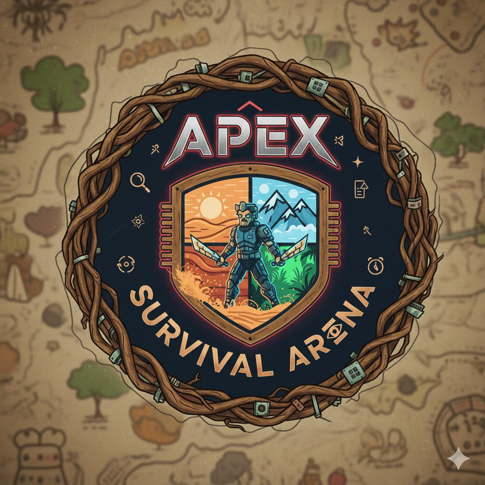

<div align="center">
    
# APEX AI SURVIVAL ARENA



**Multi-Agent Reinforcement Learning Survival Simulation with Betting Mechanics**

[](https://www.python.org/downloads/)
[](https://pytorch.org/)
[](https://www.pygame.org/)
[](LICENSE)

*Where AI agents fight for survival, and you bet on the champion*

</div>

---

## 🎥 Video Demo

**Watch the game in action:**

[](YOUR_YOUTUBE_LINK_HERE)

---

## Overview

**APEX AI SURVIVAL ARENA** combines deep reinforcement learning with survival mechanics and betting gameplay. AI agents powered by Deep Q-Networks compete in a dynamic environment with seasons, resources, and temperature regulation. Bet on your favorite agent and watch them battle for survival!

**Key Features:**
- 8+ unique AI agent personalities with DQN architecture
- Dynamic 12×12 grid world with seasons, day/night cycles, and resource management
- Betting system with persistent credit economy (start with 1000 credits)
- Modern UI with particle effects, animations, and smooth transitions
- Real-time leaderboard and comprehensive statistics

---

## Quick Start

### Windows (.exe)
1. Download the game files from the link provided in the [Releases](https://github.com/ShashankaShekharSharma/SamsungPrismHackathon/releases).
2. Extract the files to your current directory.
3. Double-click to run on the final.exe.
4. If Windows Defender blocks: Click "More info" → "Run anyway".

### macOS (.dmg)

**Step 1:** Download the DMG file from [Releases](https://github.com/ShashankaShekharSharma/SamsungPrismHackathon/releases) and place it in your current directory.

**Step 2:** Install dependencies:
```bash
pip install pygame==2.5.2 numpy==1.24.3 torch==2.1.0
```

**Step 3:** Mount and install the app:
```bash
hdiutil attach ./APEX AI Survival Arena.dmg
cp -R "/Volumes/APEX AI Survival Arena/APEX AI Survival Arena.app" /Applications/
xattr -rd com.apple.quarantine "/Applications/APEX AI Survival Arena.app"
```

**Step 4:** Launch the game:
```bash
open "/Applications/APEX AI Survival Arena.app"
```

### CLI Docker (Cross-Platform)
```bash
git clone https://github.com/ShashankaShekharSharma/SamsungPrismHackathon.git
cd SamsungPrismHackathon/CLIMode
docker-compose run --rm --build survival-cli
```

### From Source
```bash
git clone https://github.com/ShashankaShekharSharma/SamsungPrismHackathon.git
cd SamsungPrismHackathon
pip install pygame==2.5.2 numpy==1.24.3 torch==2.1.0
python cli_survival_arena.py
```

---

## Gameplay

### Controls
- `SPACE` - Play/Pause
- `↑/↓` - Adjust speed (1-100×)
- `F` - Focus mode (highlight bet agent)
- `F11` - Fullscreen
- `Mouse Wheel` - Scroll leaderboard

### How to Play
1. Select an agent from 8+ trained models
2. Choose bet amount (50-1000 credits)
3. Watch agents compete for survival
4. Win doubles your bet, loss forfeits it

---

## Technical Details

### Agent System
- **Architecture:** 5-layer DQN (512→256→128→64 neurons)
- **State Space:** 25 dimensions (position, health, resources, temperature, exploration)
- **Action Space:** 11 actions (move, eat, drink, explore, start fire, swim, rest)
- **Training:** Deep Q-Learning with experience replay

### Environment
- **World:** 12×12 procedurally generated grid
- **Seasons:** Summer, Autumn, Winter, Spring (2 days each)
- **Mechanics:** Hunger, thirst, temperature regulation, exploration, fire management
- **Death Causes:** Starvation, dehydration, hypothermia, hyperthermia

### Betting System
- Start with 1000 credits
- Bet tiers: 50, 100, 250, 500, 1000
- 2× payout on victory
- Credits persist between sessions

---

## Troubleshooting

**Windows:** If SmartScreen blocks, click "More info" → "Run anyway"

**macOS:** If "app is damaged" error appears:
```bash
xattr -rd com.apple.quarantine "/Applications/APEX AI Survival Arena.app"
```

**Docker:** If permission denied:
```bash
sudo usermod -aG docker $USER  # Then logout/login
```

**Performance:** Reduce agents or lower speed (↓ key) for better FPS

---

## System Requirements

### Minimum
- CPU: Intel i3 or equivalent
- RAM: 4GB
- OS: Windows 10/11, macOS 10.14+, Linux

### Recommended
- CPU: Intel i5+
- RAM: 8GB
- GPU: GTX 1050+ (optional, for faster inference)

---

## Contributing

Contributions welcome! Areas for improvement:
- Additional agent architectures (CNNs, Transformers)
- Enhanced environment mechanics
- Multiplayer betting system
- Pre-trained model zoo

---

## Credits

**Team Formula-4-1:**
- Hrishikesh Sarma
- Pratik Gandhi
- Hemant Thakkar
- Shashanka Shekhar Sharma
- Shubam Sarawagi

**Technologies:** PyTorch, Pygame, NumPy

---

<div align="center">

**⭐ Star this repo if you enjoyed it! ⭐**

**GitHub:** [ShashankaShekharSharma/SamsungPrismHackathon](https://github.com/ShashankaShekharSharma/SamsungPrismHackathon)

*Made with passion for Samsung PRISM Hackathon*

</div>
